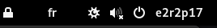

# Add hostname to top panel
GNOME Shell extension for 42 schools.  
btw it's not the hostname but the cluster position (the first argument before the . in the hostname: e1r1p1.cluster.42paris.fr).  
I'm too lazy to change the name.
## How to install
1. Clone the repository to `~/.local/share/gnome-shell/extensions/` or move it
2. Restart/refresh gnome with `alt+F2` or `alt+fn+F2` and type `r`.
3. Do `gnome-extensions enable add-hostname-toppanel` in any terminal.

## Demo

## Credits
Fork of https://github.com/brendaw/add-username-toppanel
